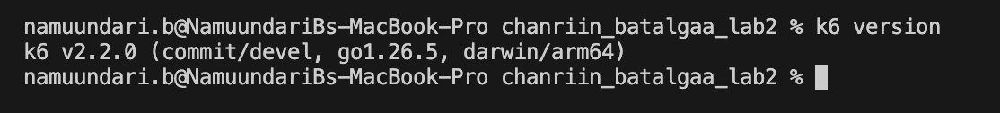
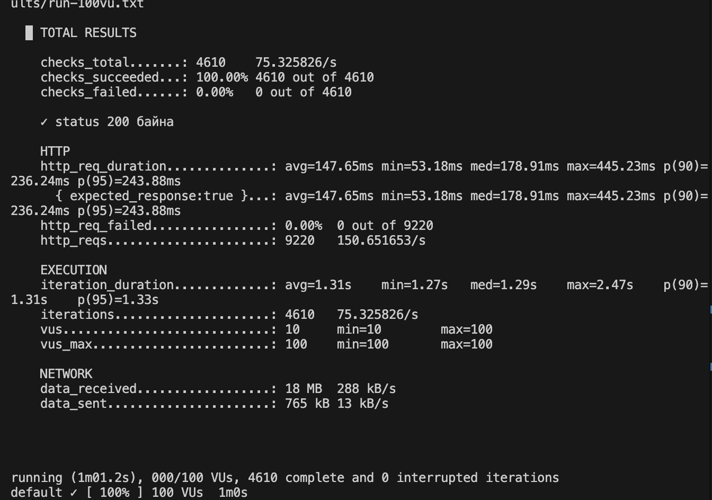
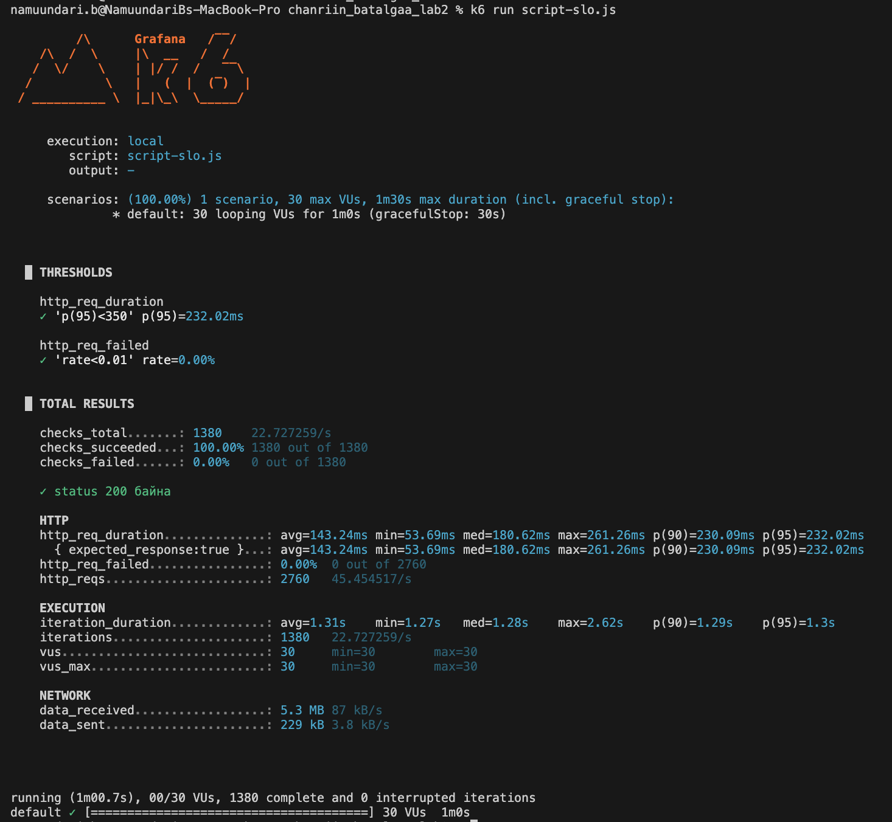
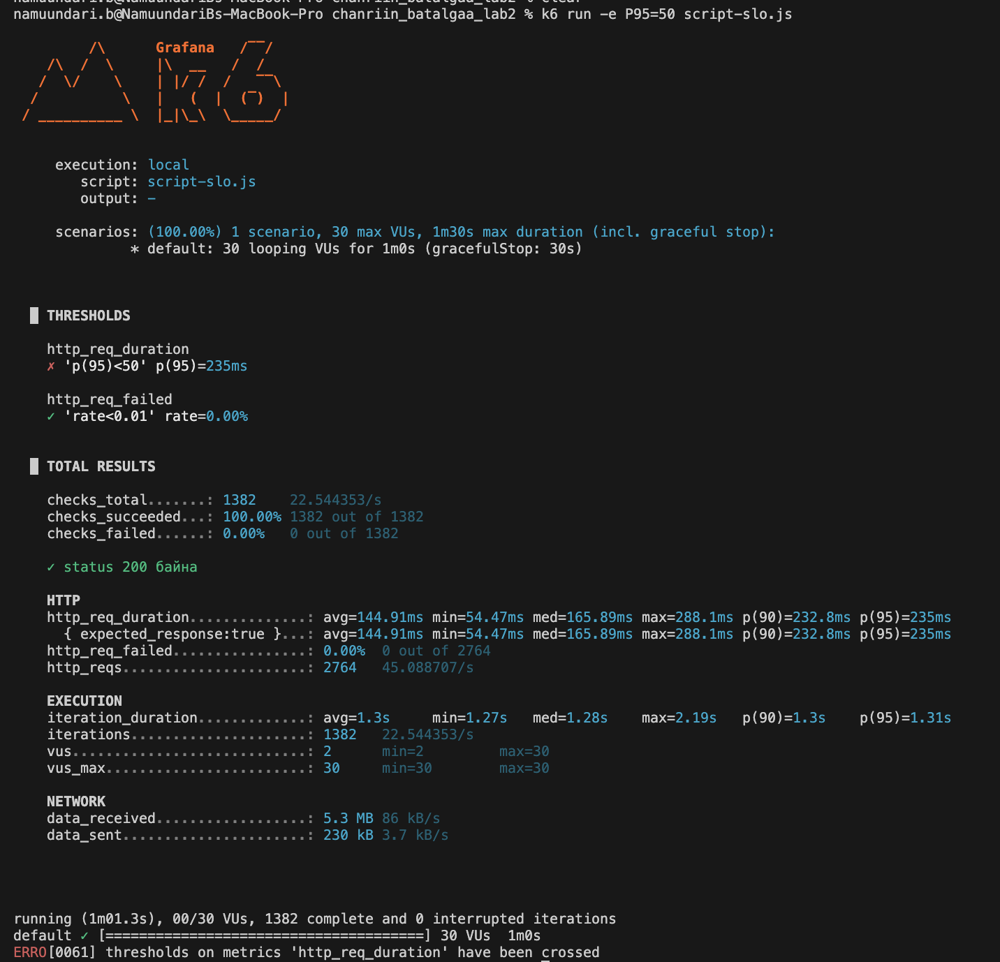
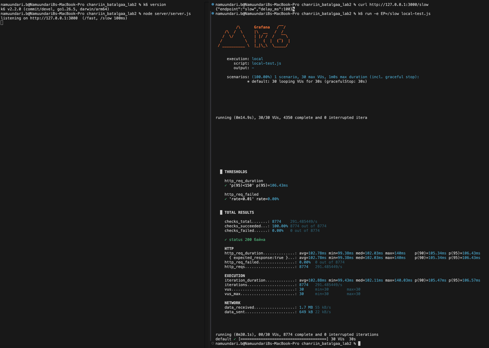

# Лабораторийн ажил №2 — k6 гүйцэтгэлийн хэмжүүр

## Оюутны мэдээлэл
- **Оюутны код:** B232270037
- **Оюутны нэр:** Б. Намуундарь

## Ашигласан хэрэгсэл
- **k6 version:** `k6 v2.2.0 (commit/devel, go1.26.5, darwin/arm64)`
- **Үйлдлийн систем:** macOS
- **Target:** `https://test.k6.io` (302-оор `quickpizza.grafana.com` руу чиглэдэг)

Бүх тест зөвхөн зөвшөөрөгдсөн дадлагын сайт `test.k6.io` рүү хийгдсэн.



> Дэлгэцийн зургууд нь нэмэлт нотолгоо. README-гийн хүснэгтийн бүх тоо [results/](results/) доторх бүтэн текст гаралтаас авагдсан бөгөөд зургууд өөр цагт ажиллуулсан тул хэдэн ms зөрж болно.

---

## Алхам 2 — Үндсэн тест (baseline)

`k6 run --vus 5 --duration 1m script.js | tee results/run-05vu.txt`

Гаралт: [results/run-05vu.txt](results/run-05vu.txt)

Summary-гээс уншсан үзүүлэлтүүд:

| Үзүүлэлт | k6 метрик | Утга |
|---|---|---|
| Дундаж хариу хугацаа | `http_req_duration` avg | 142.49 ms |
| **p90 latency** | `http_req_duration` p(90) | **229.04 ms** |
| **p95 latency** | `http_req_duration` p(95) | **230.98 ms** |
| Хамгийн хурдан / удаан | min / max | 54.09 ms / 245.03 ms |
| **Throughput** | `http_reqs` | **460 хүсэлт, 7.62 req/s** |
| **Error rate (POFOD)** | `http_req_failed` | **0.00% (0 / 460)** |
| Check амжилт | `checks_succeeded` | 100.00% (230 / 230) |

Зааврын 30 секундийн оронд 1 минут хэмжиж, Алхам 3-ын гурван түвшинтэй ижил нөхцөлөөр харьцуулсан. test.k6.io redirect хийдэг тул 1 http.get = 2 HTTP хүсэлт буюу 230 iteration = 460 хүсэлт.

**BASELINE p95 = 230.98 ms** → SLO: 230.98 × 1.5 ≈ 346 → **p(95) < 350**

---

## Алхам 3 — Ачааллыг шатлан өсгөх

Түвшин тус бүрийг **stages-гүй**, 1 минутаар тусад нь ажиллуулав:

```
k6 run --vus 5   --duration 1m script.js | tee results/run-05vu.txt
k6 run --vus 30  --duration 1m script.js | tee results/run-30vu.txt
k6 run --vus 100 --duration 1m script.js | tee results/run-100vu.txt
```

| VU | p90 | **p95** | med | max | http_reqs | **Throughput** | VU тутмын throughput | **Error rate** |
|---|---|---|---|---|---|---|---|---|
| 5 | 229.04 ms | **230.98 ms** | 151.08 ms | 245.03 ms | 460 | **7.62 req/s** | 1.52 req/s | **0.00%** |
| 30 | 232.39 ms | **236.17 ms** | 163.19 ms | 271.63 ms | 2 760 | **45.50 req/s** | 1.52 req/s | **0.00%** |
| 100 | 236.24 ms | **243.88 ms** | 178.91 ms | 445.23 ms | 9 220 | **150.65 req/s** | 1.51 req/s | **0.00%** |

Гаралтууд: [run-05vu.txt](results/run-05vu.txt) · [run-30vu.txt](results/run-30vu.txt) · [run-100vu.txt](results/run-100vu.txt)

**100 VU оргил ачаалал:**



**Throughput.** VU 20 дахин өсөхөд throughput 7.62 → 150.65 req/s болж, 19.8 дахин өссөн. Нэг VU-ийн бүтээмж ердөө 1.1% буурч, алдаа бүх түвшинд 0.00% байв.

**Хаана муудаж эхэлсэн бэ?** p95 нь 230.98 → 243.88 ms (+5.6%) буюу бага өөрчлөгдсөн. Харин max latency 245 → 445 ms (+82%) өссөн тул 30 VU-аас хойш сүүл хэсгийн latency муудаж эхэлсэн гэж үзэж болно.

Лекцийн "10 хэрэглэгчтэй 2с, 100 хэрэглэгчтэй 4с" зөрчил давтагдаагүй. `test.k6.io` бол CDN-ийн ард байрлах дадлагын сайт тул 100 VU ханатал ачаалахад хүрэлцэхгүй, мөн хугацааны нэлээд хэсэг нь тогтмол RTT (min 53 ms).

### stages хувилбар
5 → 30 → 100 VU stages туршилтаар p95 233.81 ms, max 305.02 ms, throughput 47 req/s, алдаа 0.00% гарсан. Нийт p95 бага VU-ийн үеүүдэд “живдэг” тул VU бүрийн тусдаа туршилтын үр дүнг хүснэгтэд ашиглав.

---

## Алхам 4 — Threshold (SLO) кодоор шалгуулах

Baseline p95 = 230.98 ms тул 1.5 дахин нөөц авч p(95) < 350 ms гэж SLO тогтоов. Энэ утга нь 100 VU дээр хэмжигдсэн p95 (243.88 ms)-аас дээш нөөцтэй ч хэт хол биш тул бодит доройтол үүсвэл threshold шууд унана. Алдааны SLO нь rate < 0.01 (1%). Зааврын p(95)<300-г хуулаагүй.

script-slo.js-г 30 VU, 1 минутын нөхцөлөөр ажиллуулав.

| | Команда | Threshold | Үр дүн | exit code |
|---|---|---|---|---|
| **PASS** | `k6 run script-slo.js` | `p(95)<350` | ✓ p(95) = 231.87 ms | **0** |
| **FAIL** | `k6 run -e P95=50 script-slo.js` | `p(95)<50` | ✗ p(95) = 232.12 ms | **99** |

Гаралт: [run-slo-pass.txt](results/run-slo-pass.txt) · [run-slo-fail.txt](results/run-slo-fail.txt)

**PASS** — `p(95)<350`, exit code 0:



**FAIL** — `p(95)<50`, exit code 99, CI quality gate build-ийг зогсооно:



Хоёр туршилтад алдаа 0.00% байсан. FAIL нь зөвхөн latency threshold хангаагүйгээс үүссэн бөгөөд exit code 99-өөр CI quality gate ажиллаж build-ийг зогсоох боломжтой.

### Скриптийн бүтэц
- [script.js](script.js) — Алхам 2/3, `vus/duration`, stages **байхгүй**
- [stages.js](stages.js) — Алхам 3-ын stages цикл (5→30→100→0)
- [script-slo.js](script-slo.js) — Алхам 4, thresholds
- [server/server.js](server/server.js) — Алхам 5, локал тест сервер (`/fast`, `/slow`)
- [local-test.js](local-test.js) — Алхам 5, локал сервер рүү хийх тест

stages болон `vus/duration`-г нэг файлд хольвол stages давамгайлж `vus/duration` үл тоогдоно.

---

## Алхам 5 — Локал сервер тестлэх

Node-ийн built-in `http`-ээр энгийн сервер бичив ([server/server.js](server/server.js)) — `/fast` шууд хариулна, `/slow` 100 ms санаатай саатуулна. Локал сүлжээнд RTT ~0 тул гадаад сайтын хэлбэлзэл оролцохгүй, сервер талын ажлын цэвэр нөлөө харагдана.

```
node server/server.js
k6 run -e EP=/fast local-test.js | tee results/run-local-fast.txt
k6 run -e EP=/slow local-test.js | tee results/run-local-slow.txt
```

30 VU, 30 секунд, `sleep()` зориудаар байхгүй (серверийн бодит багтаамжийг хэмжихийн тулд).

| Endpoint | avg | **p95** | max | **Throughput** | Error rate | Threshold `p(95)<150` |
|---|---|---|---|---|---|---|
| `/fast` | 435 µs | **751 µs** | 55.25 ms | **64 195 req/s** | 0.00% | ✓ PASS |
| `/slow` (100 ms) | 103.05 ms | **106.17 ms** | 112.20 ms | **290.70 req/s** | 0.00% | ✓ PASS |

Гаралт: [run-local-fast.txt](results/run-local-fast.txt) · [run-local-slow.txt](results/run-local-slow.txt)

**Зүүн талд сервер, баруун талд `/slow` тест:**



**Ялгаа.** 100 ms саатал нэмэхэд p95 141 дахин өсөж, throughput 221 дахин буурсан. Серверийн саатал нэмэгдэхэд latency өсч, throughput буурч байгаа нь хоёр хэмжүүр эсрэг чиглэлд хөдөлдгийг харуулна.

**Throughput-ын тааз.** `/slow` дээр 30 VU / 0.10305 s = 291.12 req/s гэж тооцоолсон бөгөөд бодит throughput 290.70 req/s буюу 0.14% зөрүүтэй байв. Энэ нь throughput серверийн 100 ms саатлаар хязгаарлагдаж байгааг харуулна.

**Тогтвортой байдал.** `/slow` дээр max 112.20 ms буюу p95-аас 6 ms л их. Гадаад сайт дээр max 445 ms (p95-аас 200 ms их) байсантай харьцуулахад локал орчинд хэмжилт хэр тогтвортой болохыг харуулж байна.

---

### Нэгдсэн дүгнэлт

VU 5-аас 100 болоход throughput **19.8 дахин өссөн** боловч VU тутмын бүтээмж ердөө **1.1% буурсан** тул систем ханалтанд хүрээгүй. p95 **5.6%**-иар бага өөрчлөгдсөн ч max latency **82%**-иар өссөн нь сүүл хэсгийн доройтлыг харуулсан. Дундаж хариу хугацаа 142-оос 148 ms болж бараг хөдлөөгүй тул лекцийн "p99 = хамгийн удаан 1%-ийн туршлага" гэсэн санаа батлагдав — зөвхөн дунджаар хэмжвэл доройтол огт харагдахгүй байх байлаа.

Лекцийн **POFOD** хэмжүүр бүх туршилтад **0** гарсан бол response jitter гадаад сайт дээр **392 ms**, локал `/slow` дээр ердөө **12.7 ms** байв. Сүүлийнх нь лекцийн "10с ± 1с — маш сайн" гэсэн jitter шалгуурт бүрэн нийцэж байна. Лекцийн "10 хэрэглэгчтэй 2с, 100 хэрэглэгчтэй 4с" зөрчил `test.k6.io` дээр давтагдаагүй, учир нь CDN-ийн ард байрлах сайтыг 100 VU ханатал ачаалж чадахгүй. Харин локал `/slow` тестэд latency **141 дахин өсөж**, throughput **221 дахин буурсан** нь ханалт үүсэхэд гүйцэтгэл огцом мууддагийг харууллаа.

Baseline-аас тогтоосон **p95 < 350 ms SLO** нь лекцийн SLI → SLO гинжийг практикт хэрэгжүүлсэн бөгөөд **exit code 99** нь автомат quality gate ажиллахыг баталсан. Туршилтын явцад эвдрэл гараагүй тул **ROCOF, MTBF, MTTR, Availability**-г тооцох хангалттай өгөгдөл бүрдээгүй.
